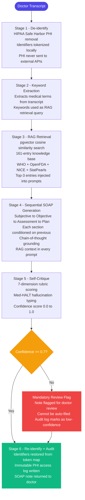

# Aurum — Agentic AI Medical Assistant

> A portfolio-grade clinical AI demonstrating production-thinking for SOAP note generation.
> Synthetic data only. Not for clinical use.

[](LICENSE)

## What this is

Aurum generates SOAP notes from doctor-patient transcripts using a 6-stage agentic pipeline with de-identification, retrieval-grounded reasoning, and self-critique. Every claim cites its source. Every decision is auditable.

This is not a ChatGPT wrapper. The pipeline is deterministic, auditable, and designed around clinical safety constraints that most LLM applications ignore.

## Architecture



## Evaluation — Aurum-SOAP-Bench v1

Built-in evaluation harness benchmarking SOAP quality across 20 MedQA-derived synthetic cases using Med-HALT hallucination taxonomy and adversarial judge framing.

### Results (N=20, 161-entry knowledge base)

| Dimension | Score | Direction |
|---|---|---|
| Hallucination | 1.90 / 5 | lower is better |
| Omission | 2.80 / 5 | lower is better |
| Faithfulness | 3.80 / 5 | higher is better |
| Groundedness | 3.85 / 5 | higher is better |
| Bias | 1.15 / 5 | lower is better |
| Fluency | 4.50 / 5 | higher is better |
| Completeness | 3.35 / 5 | higher is better |
| Calibration delta | +0.65 | 0 = perfectly calibrated |
| Aggregate score | 0.709 / 1.0 | — |

| Coverage | Rate |
|---|---|
| Expected diagnoses met | 80% |
| Red flags handled | 15% |
| Uncertainty acknowledged | 70% |

| Hallucination type | Count | Per note |
|---|---|---|
| fabricated_fact | 22 | 1.1 |
| misattributed_fact | 7 | 0.35 |
| false_reasoning | 2 | 0.1 |
| confidence_without_evidence | 1 | 0.05 |

### Key findings

- **Bias near-zero (1.15/5)** — no demographic or clinical stereotyping detected
- **Fluency excellent (4.50/5)** — publication-ready clinical writing quality
- **Calibration delta +0.65** — self-critique is self-flattering; independent judge (MiMo-V2.5-Pro) reveals the gap
- **fabricated_fact is the dominant hallucination type** — model invents plausible but unsupported clinical details
- **RAG expansion reduced hallucinations** — 2.71 to 1.90/5 after knowledge base grew from 30 to 161 entries

### Judge methodology

- Independent MiMo-V2.5-Pro judge (different vendor from generation model — reduces self-enhancement bias)
- Med-HALT hallucination taxonomy: fabricated_fact, misattributed_fact, confidence_without_evidence, false_reasoning
- Adversarial framing: judge prompted to find problems, not validate
- Calibration tracking: Pearson correlation between self-reported confidence and judge scores

## Knowledge base

161 entries across 5 authoritative sources:

| Source | Entries | Content |
|---|---|---|
| WHO Essential Medicines | 30 | Drug dosing, contraindications |
| OpenFDA drug labels | 29 | FDA-approved drug information |
| MedlinePlus summaries | 31 | Condition overviews |
| StatPearls (PubMed) | 11 | Peer-reviewed clinical abstracts |
| NHS CKS / NICE guidelines | 60 | Structured workup, red flags, differentials |

## Stack

| Layer | Technology | Why |
|---|---|---|
| Framework | Next.js 15 + TypeScript | App Router, SSE streaming |
| Database | Supabase (Postgres + pgvector) | Auth, RLS, vector similarity |
| LLM (generation) | Groq Llama 3.3 70B | 700 tok/s, high quality |
| LLM (evaluation) | MiMo-V2.5-Pro | Different vendor, reduces judge bias |
| Embeddings | Gemini text-embedding-001 | 768-dim, Matryoshka |
| UI | shadcn/ui + Tailwind | Production-grade components |
| Deploy | Vercel | Zero-config Next.js |

## Key design decisions

See [`docs/adr/`](docs/adr/) for full context.

- [ADR-001: Custom LLM abstraction over LangChain](docs/adr/001-custom-llm-abstraction.md)
- [ADR-002: Deterministic workflow over autonomous agent loop](docs/adr/002-workflow-not-autonomous-agent.md)
- [ADR-003: De-identify before LLM calls](docs/adr/003-deidentify-before-llm.md)
- [ADR-004: Sequential SOAP with self-critique](docs/adr/004-sequential-soap-with-self-critique.md)
- [ADR-005: RAG with multi-source clinical knowledge base](docs/adr/005-rag-with-clinical-knowledge-base.md)

## Scope and limitations

**Phase A (current — portfolio):**
- Synthetic data only
- Knowledge base covers 20 common outpatient conditions
- Single doctor account
- No voice transcription
- Plan item specificity improving (5% with current knowledge base)
- Red flag handling at 15% — addressed in v2 prompt hardening

**Phase B (planned):**
- Real patient data with full HIPAA compliance and BAA
- Multi-tenant with role-based access
- Voice transcription via Whisper
- Expanded knowledge base (full NICE guidelines, UpToDate)
- Reflexion-style re-generation loop

## Running locally

```bash
git clone https://github.com/Vyomkesh13/Aurum
cd Aurum
npm install
cp .env.example .env.local
# Fill in API keys — see .env.example
npm run dev
```

## Disclaimer

Aurum is a portfolio demonstration built on synthetic data. It is not a medical device, does not provide medical advice, and is not approved for clinical use. All patient data shown is artificially generated.
